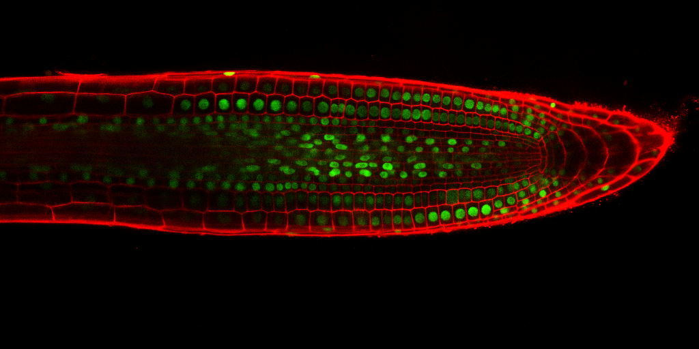

# Coursework: “Extracting & Analyzing Cell Nuclei”

- Name : Chai Wen Jye
- Student ID : 20113681
- Module : COMP2032 - Introduction to Image Processing
- Module Convenor : Dr. Amr Ahmed

# Objective

- Design a solution, and implment it in a Matlab program, that accpets a microscopic images as an input and outputs:

	- Binary image marking regions corresponding to nuclei.
	- Total count of nuclei detected in each image.
	- Analysis of the detected nuclei regarding their sizes, shapes and signal intensity

# Instruction
To run the Matlab code:

1) Unzip and extract the repositories into preferred directories

2) Ensure the preferred directories has been path inside the Matlab 

3) Include the images that needed to be processed into the folder named as 'CW_images'

4) Run the program

5) The program shall return multiple windows that provide statistical insights regarding the nuclei's size distribution, intensity distribution and shape distributions 

Files included in the zip folder:

- README.txt

- final_code.m

- Explanation Video for COMP2032 Assignment.mp4

- Written Report for COMP2032 Assignment.pdf

- CW_images

	|_ StackNinja1.bmp

	|_ StackNinja2.bmp

	|_ StackNinja3.bmp
	
	|_Example Result.png

# Example Result:

